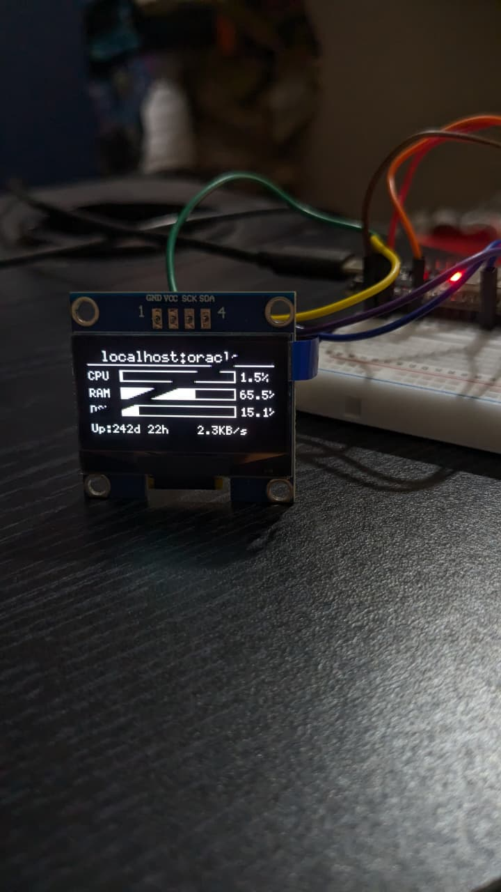
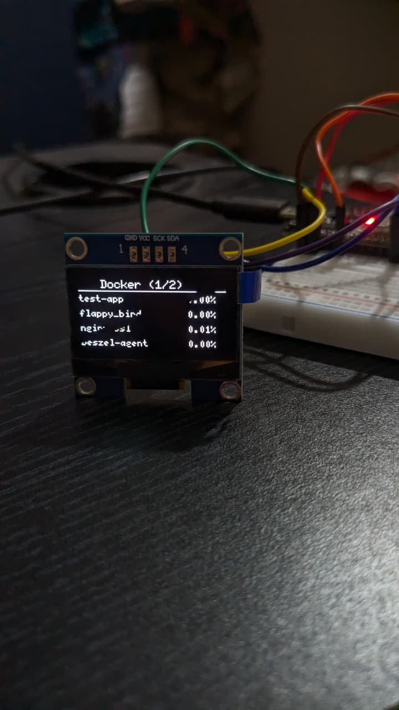
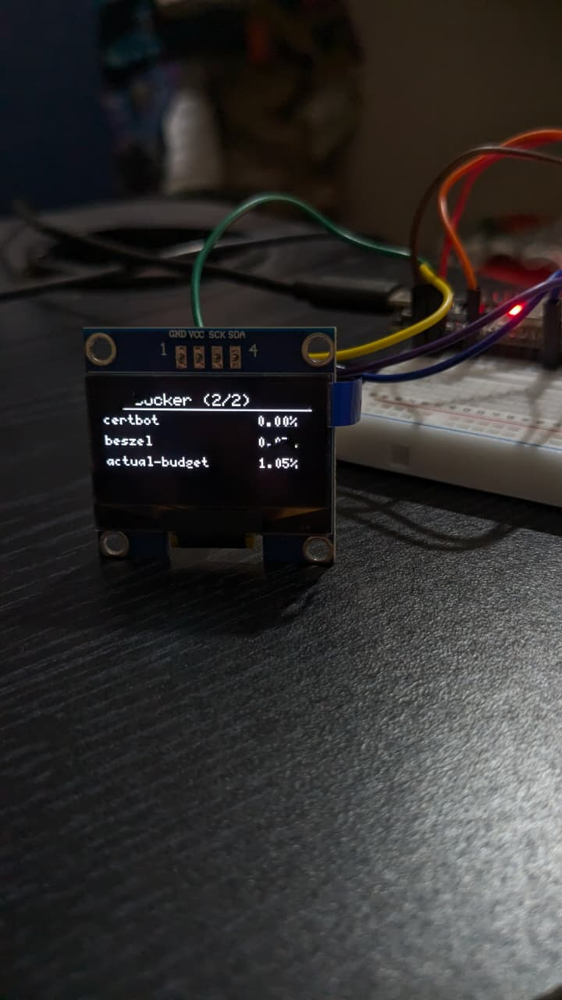
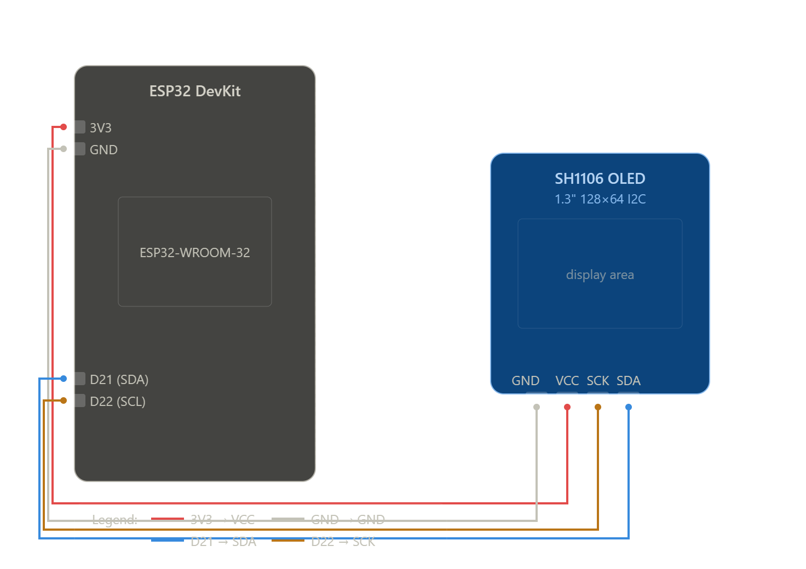

# ESP32 Beszel Monitor

A physical server monitoring dashboard built with an ESP32 and a 1.3" SH1106 OLED display. Fetches live stats from a [Beszel](https://github.com/henrygd/beszel) instance and displays them on a tiny screen — CPU, RAM, disk, network, uptime, and all Docker containers, cycling automatically.





---

## What it does

- Connects to your Beszel instance over WiFi 
- Authenticates via Beszel's PocketBase API
- Refreshes stats every 30 seconds
- Cycles through screens every 5 seconds:
  - **Screen 1** — VM stats: CPU, RAM, Disk (with progress bars), uptime, network
  - **Screen 2+** — Docker containers: name and CPU usage, 4 per page

---

## Hardware

| Component | Details |
|-----------|---------|
| Microcontroller | ESP32 DevKit V4 (ESP32-D0WD-V3) |
| Display | 1.3" SH1106 OLED 128x64 I2C |

### Wiring

| OLED Pin | ESP32 Pin |
|----------|-----------|
| GND | GND |
| VCC | 3.3V |
| SCK | D22 |
| SDA | D21 |

---

## Software Requirements

### Arduino IDE Board Package
- ESP32 by Espressif (v3.x) via Board Manager

### Libraries (install via Library Manager)
- **U8g2** by olikraus
- **ArduinoJson** by Benoit Blanchon (v6.x)

---

## Setup

### 1. Clone the repo

```bash
git clone https://github.com/yourusername/esp32-beszel-monitor
cd esp32-beszel-monitor
```

### 2. Configure credentials

Open `beszel_monitor.ino` and fill in the config section at the top:

```cpp
const char* WIFI_SSID     = "YOUR_WIFI_SSID";
const char* WIFI_PASSWORD = "YOUR_WIFI_PASSWORD";
const char* BESZEL_URL    = "https://your.beszel.domain";
const char* BESZEL_EMAIL  = "your@email.com";
const char* BESZEL_PASS   = "yourpassword";
const char* SYSTEM_ID     = "your_system_id";
```

### 3. Find your System ID

Log into Beszel and click on your system. The ID is in the URL:
```
https://your.beszel.domain/system/np97pp5jn9tfe99
                                   ^^^^^^^^^^^^^^^^
                                   this is your system ID
```

### 4. Arduino IDE settings

| Setting | Value |
|---------|-------|
| Board | ESP32 Dev Module |
| Flash Mode | DIO |
| Flash Frequency | 40MHz |
| Flash Size | 4MB |
| Partition Scheme | Default 4MB with spiffs |
| Upload Speed | 115200 |

### 5. Upload

Hit upload. On first boot the OLED will show:
```
Connecting WiFi...
Authenticating...
Fetching stats...
```
Then the dashboard appears.

---

## Screens

### Screen 1 — VM Stats
```
 localhost:oracle
────────────────
CPU ████████░░ 1.5%
RAM ███████░░░ 65.2%
DSK ██░░░░░░░░ 15.1%
Up: 242d 6h    1.2KB/s
```

### Screen 2+ — Docker Containers
```
   Docker (1/2)
────────────────
actual-budget  0.66%
beszel         0.03%
beszel-agent   0.01%
certbot        0.00%
```

---

## How it works

Beszel is built on [PocketBase](https://pocketbase.io) and exposes a REST API. The ESP32:

1. Authenticates with email/password to get a JWT token
2. Fetches system stats from `/api/collections/systems/records/{id}`
3. Fetches container stats from `/api/collections/containers/records`
4. Parses JSON responses using ArduinoJson
5. Renders everything on the OLED using U8g2
6. Refreshes every 30 seconds, rotates screens every 5 seconds

The token is automatically renewed when it expires (every hour).

---

## Customization

| What | Where |
|------|-------|
| Screen rotation speed | `SCREEN_INTERVAL` (default 5000ms) |
| Data refresh rate | `FETCH_INTERVAL` (default 30000ms) |
| Containers per page | Change `4` in `drawContainerScreen()` |
| Add temperature/humidity | Wire a DHT11 to D4 and add a screen |

---

## Connection Diagram



Four connections total:

| Wire | From (ESP32) | To (OLED) |
|------|-------------|-----------|
| 🔴 Red | 3V3 | VCC |
| ⚫ Black | GND | GND |
| 🔵 Blue | D21 | SDA |
| 🟡 Yellow | D22 | SCK |


## Troubleshooting

**OLED shows nothing**
- Check SDA/SCL wiring (D21/D22)
- Confirm display is SH1106, not SSD1306 (different driver)

**WiFi not connecting**
- Double check SSID and password
- ESP32 only supports 2.4GHz networks

**Auth failed**
- Verify your Beszel URL is accessible from your network
- Check email and password are correct
- Make sure Cloudflare isn't blocking the request

**No container data**
- Verify your system ID is correct
- Check that Beszel agent is running on your VM

**Boot loop / not starting**
- Open Serial Monitor at 115200 baud to see error messages
- Try erasing flash and re-uploading:
  ```
  esptool --chip esp32 --port COMX erase-flash
  ```

---

## License

MIT — do whatever you want with it.

---

## Acknowledgements

- [Beszel](https://github.com/henrygd/beszel) by Henry Gd — the lightweight server monitor that makes this possible
- [U8g2](https://github.com/olikraus/u8g2) by olikraus — excellent OLED library
- [ArduinoJson](https://arduinojson.org) by Benoit Blanchon — JSON parsing on embedded systems

---
